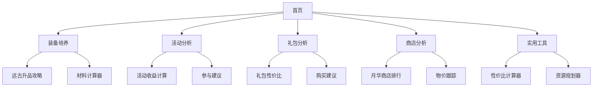

## 1. 产品概述
冒险岛枫之传说攻略站是一个专为《冒险岛：枫之传说》手游玩家打造的综合性攻略平台。网站致力于为玩家提供装备培养指导、活动收益分析、礼包性价比评估等核心服务，帮助玩家优化游戏资源投入，提升游戏体验。

目标用户群体为追求游戏效率和价值最大化的中高端玩家，通过数据分析和专业攻略为玩家提供决策参考和游戏福利信息。

## 2. 核心功能

### 2.1 用户角色
本攻略站主要面向游客用户，无需注册即可访问所有攻略内容。未来可考虑添加用户收藏和个性化推荐功能。

| 角色 | 访问方式 | 核心权限 |
|------|----------|----------|
| 游客用户 | 直接访问 | 浏览所有攻略内容、使用计算工具 |
| 管理员 | 后台登录 | 内容编辑、数据更新、系统管理 |

### 2.2 功能模块
攻略站包含以下核心页面：
1. **首页**：网站导航、热门攻略推荐、最新活动分析。
2. **装备培养页**：远古装备升品攻略、星之力强化指南、装备制作材料清单。
3. **活动分析页**：限时活动收益计算、活动参与建议、奖励价值评估。
4. **礼包分析页**：在线优惠礼包性价比分析、各类礼包价值对比、购买建议。
5. **商店分析页**：月华商店性价比排行、枫币商店推荐、各类商店物品价值分析。
6. **工具页面**：性价比计算器、资源规划工具、收益对比工具。

### 2.3 页面详情
| 页面名称 | 模块名称 | 功能描述 |
|-----------|-------------|-------------|
| 首页 | 导航栏 | 提供网站主要功能入口，包含装备、活动、礼包、商店四大板块快速访问。 |
| 首页 | 热门攻略 | 展示当前版本最受欢迎的攻略内容，支持按浏览量排序。 |
| 首页 | 最新活动 | 显示游戏内正在进行的活动信息，包含收益分析和参与建议。 |
| 装备培养页 | 远古升品攻略 | 详细介绍远古装备升品条件、材料需求、成功率等核心信息。 |
| 装备培养页 | 材料计算器 | 根据目标装备自动计算所需材料数量和获取方式。 |
| 装备培养页 | 升品建议 | 基于成功率提供升品策略建议，包含保底机制说明。 |
| 活动分析页 | 活动列表 | 展示当前和即将开始的游戏活动，包含时间、奖励、参与条件。 |
| 活动分析页 | 收益计算器 | 输入活动参与数据，自动计算时间投入与奖励价值比。 |
| 活动分析页 | 参与建议 | 根据玩家类型（挂机党、提升党、休闲党）提供个性化建议。 |
| 礼包分析页 | 礼包列表 | 展示游戏内各类礼包信息，包含价格、内容物、限制条件。 |
| 礼包分析页 | 性价比排行 | 基于红钻/蓝钻价值比对礼包进行性价比排序。 |
| 礼包分析页 | 购买建议 | 根据玩家预算和需求提供礼包购买优先级建议。 |
| 商店分析页 | 月华商店排行 | 展示月华商店物品性价比排行，包含汇率计算和购买建议。 |
| 商店分析页 | 其他商店 | 枫币商店、金蘑菇商店等的价格对比和推荐物品。 |
| 商店分析页 | 物价跟踪 | 记录重要物品价格变化趋势，提供购买时机建议。 |
| 工具页面 | 性价比计算器 | 自定义输入物品价格和价值，计算性价比指数。 |
| 工具页面 | 资源规划器 | 帮助玩家规划游戏资源投入，优化成长路径。 |

## 3. 核心流程

### 用户访问流程
1. 用户通过浏览器访问网站首页
2. 浏览热门攻略或选择特定功能板块
3. 查看详细攻略内容或使用计算工具
4. 根据攻略建议优化游戏决策
5. 定期回访获取最新攻略信息

### 内容更新流程
管理员定期收集游戏数据 → 分析更新内容 → 编写攻略文档 → 上传至网站 → 推送至相关页面

## 4. 用户界面设计

### 4.1 设计风格
- **主色调**：深蓝色 (#1976D2) 体现游戏的冒险主题
- **辅助色**：橙色 (#FF9800) 用于强调重要信息和按钮
- **背景色**：浅灰色 (#F5F5F5) 提供良好的阅读体验
- **按钮样式**：圆角矩形设计，悬停效果增强交互感
- **字体选择**：微软雅黑为主，数字部分使用等宽字体便于对比
- **布局风格**：卡片式布局，信息层次清晰
- **图标风格**：使用游戏风格图标，保持视觉一致性

### 4.2 页面设计概述
| 页面名称 | 模块名称 | UI元素 |
|-----------|-------------|-------------|
| 首页 | 导航栏 | 顶部固定导航，包含Logo、主要功能入口、搜索框 |
| 首页 | 热门攻略 | 网格布局展示攻略卡片，包含标题、简介、更新时间 |
| 首页 | 最新活动 | 轮播图展示重要活动，下方列表显示详细活动信息 |
| 装备培养页 | 攻略内容 | 清晰的标题层级，表格展示材料需求，步骤说明配图 |
| 装备培养页 | 计算器 | 输入框组设计，实时计算结果显示，历史记录保存 |
| 活动分析页 | 活动卡片 | 时间轴设计，活动状态标识，奖励预览图 |
| 礼包分析页 | 礼包对比 | 表格形式展示多礼包对比，性价比高亮显示 |
| 商店分析页 | 排行榜 | 分级显示(T0/T1/T2)，颜色区分重要性，汇率计算展示 |
| 工具页面 | 计算器 | 简洁的输入界面，实时计算结果，公式说明 |

### 4.3 响应式设计
- **桌面优先**：主要针对PC端用户优化，提供最佳浏览体验
- **移动端适配**：支持平板和手机访问，采用响应式布局
- **触摸优化**：按钮和交互元素适配触摸操作，增大点击区域

## 5. 内容管理

### 5.1 数据源结构
网站内容基于本地Markdown文件构建，包含以下分类：
- **装备攻略**：远古装备升品、星之力强化等
- **活动分析**：各类限时活动的参与建议和收益分析
- **礼包分析**：在线优惠礼包、各类礼包的性价比评估
- **商店指南**：月华商店、枫币商店等的价格对比和推荐

### 5.2 更新机制
- **定期更新**：跟随游戏版本更新，及时调整攻略内容
- **数据维护**：定期检查和更新物价信息、活动数据
- **用户反馈**：收集用户建议，优化攻略质量和实用性