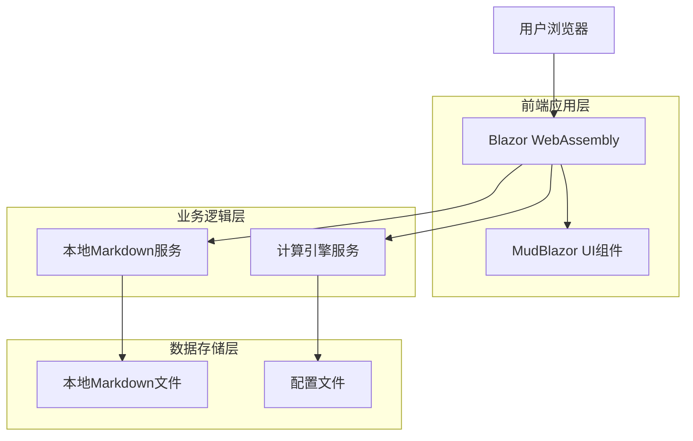
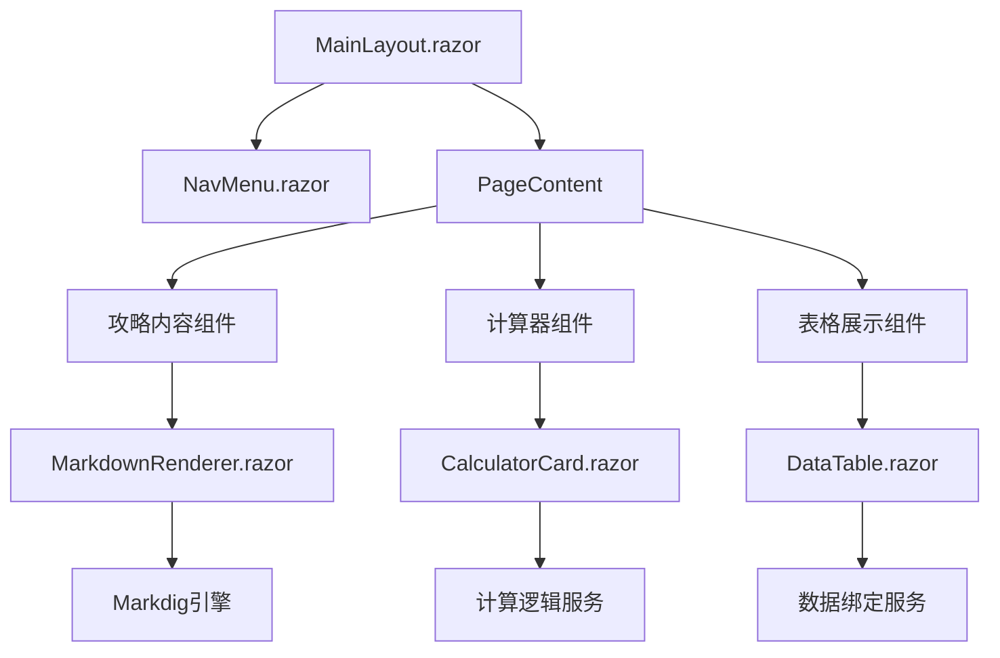

## 1. 架构设计



## 2. 技术描述

### 核心技术栈
- **前端框架**: Blazor WebAssembly .NET 8
- **UI组件库**: MudBlazor 6.x
- **开发语言**: C# 
- **构建工具**: .NET CLI
- **部署方式**: 静态文件托管 (GitHub Pages/Vercel/Netlify)

### 依赖库
- **MudBlazor**: 现代化Material Design组件库
- **Markdig**: Markdown解析引擎
- **System.Text.Json**: JSON序列化
- **Microsoft.AspNetCore.Components.WebAssembly**: Blazor WebAssembly运行时

## 3. 路由定义

| 路由 | 用途 | 页面组件 |
|-------|---------|----------|
| / | 首页，展示热门攻略和最新活动 | Home.razor |
| /equipment | 装备培养攻略总览 | Equipment.razor |
| /equipment/ancient-upgrade | 远古装备升品详细攻略 | AncientUpgrade.razor |
| /equipment/star-force | 星之力强化指南 | StarForce.razor |
| /events | 活动分析首页 | Events.razor |
| /events/analysis | 具体活动收益分析 | EventAnalysis.razor |
| /packages | 礼包分析总览 | Packages.razor |
| /packages/online-discount | 在线优惠礼包分析 | OnlineDiscount.razor |
| /shops | 商店分析首页 | Shops.razor |
| /shops/moonlight | 月华商店性价比排行 | MoonlightShop.razor |
| /shops/maple-coin | 枫币商店推荐 | MapleCoinShop.razor |
| /tools | 实用工具集合 | Tools.razor |
| /tools/calculator | 性价比计算器 | Calculator.razor |
| /tools/planner | 资源规划器 | Planner.razor |

## 4. 组件架构

### 4.1 核心组件设计


### 4.2 主要组件说明

#### MarkdownRenderer组件
负责解析和渲染Markdown文件内容：
```csharp
@code {
    [Parameter] public string FilePath { get; set; }
    [Parameter] public bool EnableTables { get; set; } = true
    [Parameter] public bool EnableMath { get; set; } = false
    
    private string htmlContent;
    
    protected override async Task OnParametersSetAsync()
    {
        var markdownContent = await LoadMarkdownFile(FilePath);
        htmlContent = ConvertMarkdownToHtml(markdownContent);
    }
}
```

#### CalculatorCard组件
用于展示各类计算器界面：
```csharp
@code {
    [Parameter] public string Title { get; set; }
    [Parameter] public RenderFragment InputContent { get; set; }
    [Parameter] public RenderFragment ResultContent { get; set; }
    [Parameter] public EventCallback<CalculatorResult> OnCalculate { get; set; }
}
```

#### DataTable组件
用于展示排行榜和对比表格：
```csharp
@code {
    [Parameter] public List<T> Data { get; set; }
    [Parameter] public List<ColumnDefinition> Columns { get; set; }
    [Parameter] public bool EnableSorting { get; set; } = true
    [Parameter] public bool EnableFiltering { get; set; } = false
}
```

## 5. 数据模型

### 5.1 核心数据结构
```csharp
public class ShopItem
{
    public string Name { get; set; }
    public decimal Price { get; set; }
    public string Currency { get; set; }
    public decimal Value { get; set; }
    public string ValueCurrency { get; set; }
    public decimal Ratio { get; set; }
    public string Tier { get; set; }
    public string Notes { get; set; }
}

public class PackageItem
{
    public string Name { get; set; }
    public decimal Price { get; set; }
    public string Currency { get; set; }
    public List<RewardItem> Rewards { get; set; }
    public decimal TotalValue { get; set; }
    public decimal ValueRatio { get; set; }
    public string Recommendation { get; set; }
}

public class EquipmentGuide
{
    public string Title { get; set; }
    public string Category { get; set; }
    public string Difficulty { get; set; }
    public List<string> Requirements { get; set; }
    public List<MaterialItem> Materials { get; set; }
    public decimal SuccessRate { get; set; }
    public string Content { get; set; }
}

public class EventInfo
{
    public string Name { get; set; }
    public DateTime StartDate { get; set; }
    public DateTime EndDate { get; set; }
    public string EventType { get; set; }
    public List<RewardItem> Rewards { get; set; }
    public decimal TimeInvestment { get; set; }
    public decimal ValueScore { get; set; }
    public string Recommendation { get; set; }
}
```

### 5.2 货币价值基准
```csharp
public static class CurrencyRates
{
    // 基准汇率 (相对于红钻)
    public const decimal RedDiamond = 1.0m;
    public const decimal BlueDiamond = 0.5m;    // 1红钻 = 2蓝钻
    public const decimal MoonlightShard = 30.0m; // 1月华碎片 ≈ 30红钻
    public const decimal MapleCoin = 0.01m;     // 估算汇率
    public const decimal GoldMushroom = 1.0m;   // 1金蘑菇 = 1红钻
}
```

## 6. 服务层设计

### 6.1 Markdown文件服务
```csharp
public interface IMarkdownService
{
    Task<string> LoadContentAsync(string fileName);
    Task<T> LoadDataAsync<T>(string fileName) where T : class;
    Task<List<T>> LoadTableDataAsync<T>(string fileName) where T : class;
}

public class LocalMarkdownService : IMarkdownService
{
    private readonly HttpClient _httpClient;
    
    public async Task<string> LoadContentAsync(string fileName)
    {
        var filePath = $"data/{fileName}";
        return await _httpClient.GetStringAsync(filePath);
    }
    
    public async Task<List<T>> LoadTableDataAsync<T>(string fileName)
    {
        var content = await LoadContentAsync(fileName);
        return ParseMarkdownTable<T>(content);
    }
}
```

### 6.2 计算引擎服务
```csharp
public interface ICalculatorService
{
    decimal CalculateValueRatio(PackageItem package);
    decimal CalculateShopItemRatio(ShopItem item);
    decimal CalculateEventScore(EventInfo eventInfo);
    List<ShopItem> GetShopRecommendations(List<ShopItem> items, string userType);
}

public class CalculatorService : ICalculatorService
{
    public decimal CalculateValueRatio(PackageItem package)
    {
        var totalValue = package.Rewards.Sum(r => r.Value * r.Quantity);
        return totalValue / package.Price;
    }
    
    public List<ShopItem> GetShopRecommendations(List<ShopItem> items, string userType)
    {
        return items.Where(i => i.Tier == "T0" || 
            (userType == "挂机党" && i.Name.Contains("自动战斗")) ||
            (userType == "提升党" && i.Name.Contains("催化剂")))
            .OrderByDescending(i => i.Ratio)
            .ToList();
    }
}
```

## 7. 部署配置

### 7.1 项目结构
```
MapleStoryMGuide/
├── wwwroot/
│   ├── data/                    # Markdown数据文件
│   │   ├── equipment/          # 装备攻略
│   │   ├── events/             # 活动分析
│   │   ├── packages/           # 礼包分析
│   │   └── shops/              # 商店指南
│   ├── css/                    # 样式文件
│   ├── js/                     # JavaScript文件
│   └── index.html              # 入口文件
├── Pages/                      # Blazor页面组件
├── Shared/                     # 共享组件
├── Services/                   # 业务服务
├── Models/                     # 数据模型
├── _Imports.razor              # 全局引用
└── Program.cs                  # 应用入口
```

### 7.2 构建配置
```xml
<!-- MapleStoryMGuide.csproj -->
<Project Sdk="Microsoft.NET.Sdk.BlazorWebAssembly">
  
  <PropertyGroup>
    <TargetFramework>net8.0</TargetFramework>
    <Nullable>enable</Nullable>
    <ImplicitUsings>enable</ImplicitUsings>
  </PropertyGroup>
  
  <ItemGroup>
    <PackageReference Include="Microsoft.AspNetCore.Components.WebAssembly" Version="8.0.0" />
    <PackageReference Include="Microsoft.AspNetCore.Components.WebAssembly.DevServer" Version="8.0.0" />
    <PackageReference Include="MudBlazor" Version="6.11.0" />
    <PackageReference Include="Markdig" Version="0.33.0" />
  </ItemGroup>
  
</Project>
```

### 7.3 性能优化
- **懒加载**：按功能模块分割代码，按需加载
- **缓存策略**：Markdown内容本地缓存，减少重复加载
- **图片优化**：使用WebP格式，支持懒加载
- **CDN加速**：静态资源使用CDN分发

## 8. 开发规范

### 8.1 命名规范
- **组件命名**：使用PascalCase，后缀为组件类型
- **服务命名**：使用动词+名词组合，如`LoadDataAsync`
- **变量命名**：使用camelCase，保持语义清晰
- **常量命名**：使用UPPER_CASE，单词间用下划线分隔

### 8.2 代码组织
- **单一职责**：每个组件/服务只负责一个功能
- **依赖注入**：使用.NET内置DI容器管理服务
- **错误处理**：统一异常处理机制
- **日志记录**：关键操作记录日志便于调试